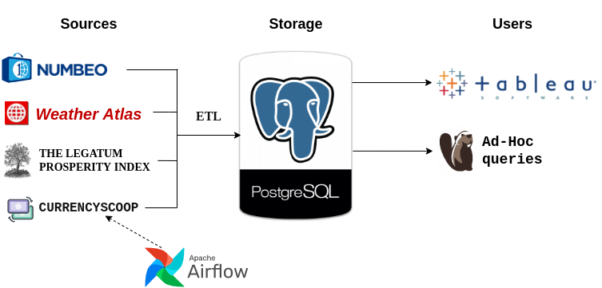

# Relohelper project

To help with choosing a city (country) for relocation, I decided to collect in one place data on the cost of living in major cities of the world from [numbeo index](https://www.numbeo.com/cost-of-living/rankings_current.jsp), climate ([weather atlas](https://www.weather-atlas.com/)) and various indices ([numbeo](https://www.numbeo.com/cost-of-living/) & [legatum](https://www.prosperity.com/rankings)) with the ability to visually compare over 10 cities simultaneously. For this I created an ETL process and displaying the indexes in Tableau. The architecture of this solution is shown below.

Also added the ability to select 5 currencies. The exchange rate is updated every day.

There are 2 roles involved in project creation: data engineer and analyst, who works in Jupyter Notebook.
DE creates a Jupyter kernel on the VPS and gives a token to the analyst for access.
The analyst analyzes the cities in the numbeo index, removes unnecessary data, and creates master tables for further scraping, which the DE performs. The analyst also gets read access to the final database to do SQL Ad-Hoc queries.
Users get access to the dashboard that Tableau Server outputs on the hosting [relohelper.online](http://relohelper.online/). The dashboard is also duplicated in [Tableau Public](https://tableau.com/). I'm using the trial version of the Tableau server, which is valid for 2 weeks and I don't know what happens next.

Read access to data base: 

The project diagram looks like this:

Tableau dasboard screenshot:

P.S. This is a training project, so I practiced on scraping and didn't get the API data.

What are the benefits:
- General - everything in one place on one page.
- Numbeo cost of living - possibility to compare more than ten cities simultaneously + visual part
- Numbeo indices - you can get confused and a lot scattered on the site. Now everything in one place + visual component helps to understand which index is good and which is bad.
- Climate - you couldn't compare cities with each other at all. Now you can.
- Legatum index - a good table on the site, but there is no way to track changes over the years in dynamics. I have this.