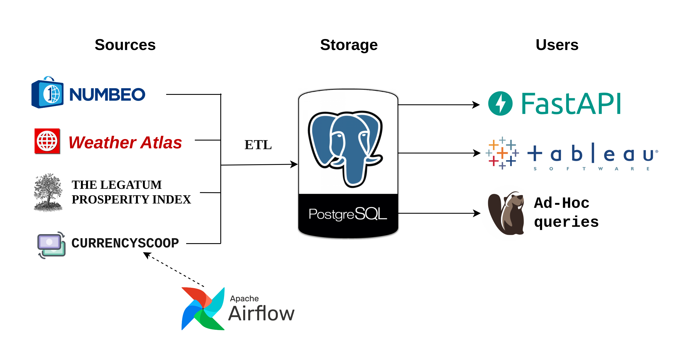

# Relohelper

**Architecture of the project**

[relohelper.space/docs](http://relohelper.space/docs)  — FastAPI Swagger UI

**Content**
- [Scraping](#Scraping)
- [Storage](#Storage)
- [Airflow](#Airflow)
- [FastAPI](#FastAPI)
  - [Locust performance testing](#Locust performance testing)
  - [Observability](#Observability)
- [Tableau](#Tableau)
- [Benefits](#What-are-the-benefits)

### Scraping
To help with choosing a city (country) for relocation, I've collected in one place data on the cost of living in major cities of the world from the [Numbeo Index](https://www.numbeo.com/cost-of-living/rankings_current.jsp), climate ([Weather Atlas](https://www.weather-atlas.com/)) and various indices ([Numbeo](https://www.numbeo.com/cost-of-living/) & [Legatum](https://www.prosperity.com/rankings)).

### Storage
All scraped data is stored in the PostgresQL in the **RELOHELPER** DB.
Here is the ER-diagram.

Here is the ER-diagram of **SECURITY** DB which stores FastAPI user data.

### Airflow
Also, I added the ability to select 5 currencies. The exchange rate is updated every day by Airflow.

### FastAPI
Thanks to FastAPI you have the opportunity to receive collected information on a single city or country in JSON format. To get more data, you need to register on [relohelper.space](http://relohelper.space/docs) and confirm your email (check your spam folder).

- #### Locust performance testing
  I made one release ([v0.1.1](https://github.com/denis-k2/relohelper/releases/tag/v0.1.1)) with the **synchronous** code, another release ([v0.2.0](https://github.com/denis-k2/relohelper/releases/tag/v0.2.0)) with **asynchronous** code. I also compared their work under load with different settings with *Locust*. The comparison results are [here](https://github.com/denis-k2/relohelper/blob/main/fastapi/tests/locust/summary_table.md).
  
- #### Observability
  Observing the Relohelper FastAPI application using three observability pillars on [Grafana](https://github.com/grafana/grafana):
   - Traces with [Tempo](https://github.com/grafana/tempo) and [OpenTelemetry Python SDK](https://github.com/open-telemetry/opentelemetry-python)
   - Metrics with [Prometheus](https://prometheus.io/) and [Prometheus Python Client](https://github.com/prometheus/client_python)
   - Logs with [Loki](https://github.com/grafana/loki)
  
  Based on the [blueswen/fastapi-observability](https://github.com/blueswen/fastapi-observability) project.
  
  Realized in [v0.3.0](https://github.com/denis-k2/relohelper/releases/tag/v0.3.0)
   
### Tableau
Users can view the dashboard on [Tableau Public](https://public.tableau.com/app/profile/smagindenis/viz/relohelper/Dashboard1#1).
Tableau dashboard screenshot.

### What are the benefits:
- General - everything in one place on one dashboard or one JSON.
- Numbeo Cost of Living - possibility to compare more than ten cities simultaneously + visual part
- Numbeo Indices - you can get confused and a lot scattered on the site. Now everything is in one place + visual component helps to understand which index is good and which is bad.
- Climate - you couldn't compare cities with each other at all. Now you can.
- Legatum Index - a good table on the site, but there is no way to track changes over the years in dynamics. I have this.

